# Get Started with Spring Boot, OAuth 2.0, and Okta

If you’re building a Spring Boot application, you’ll eventually need to add user authentication. You can do this with OAuth 2.0 (henceforth: OAuth). OAuth is a standard that applications can use to provide client applications with “secure delegated access”. It works over HTTP and authorizes devices, APIs, servers, and applications with access tokens rather than credentials.

Very simply, OAuth is a protocol that supports authorization workflows. It gives you a way to ensure that a specific user has specific permission.

OAuth doesn’t validate a user’s identity — that’s taken care of by an authentication service like Okta. Authentication is when you validate a user’s identity (like asking for a username / password to log in), whereas authorization is when you check to see what permissions an existing user already has.

In this tutorial you’ll build an OAuth client for a Spring Boot application, plus add authentication with the Okta Platform API. You can sign up for a [forever-free Okta developer account here](https://www.okta.com/developer/signup/).

If you don’t want to code along, feel free to grab the [source code from GitHub](https://github.com/oktadeveloper/okta-spring-boot-oauth-example)!

## Get Started with Spring Cloud

Spring Cloud Security is a project from the good folks at Pivotal that "offers a set of primitives for building secure applications and services with minimum fuss". Not only is it easy to use in platforms like Cloud Foundry, but it builds on Spring Boot, Spring Security, and [OAuth](https://www.oauth.com/). Because it builds on OAuth, it's easy to integrate it with an authentication API like Okta's.

The Spring Cloud Security project includes a [great quickstart](https://github.com/spring-cloud/spring-cloud-security/blob/master/docs/src/main/asciidoc/quickstart.adoc) that will help you get started with very few lines of code.
 
## Create a Secure Spring Boot App

Creating a Spring Boot application is dirt simple if you use the Spring CLI. It allows you to write Groovy scripts that get rid of the boilerplate Java and build file configuration. This allows you, the developer, to focus on the necessary code. Refer to the project's [official documentation for installation instructions](https://docs.spring.io/spring-boot/docs/current/reference/html/getting-started-installing-spring-boot.html#getting-started-installing-the-cli). To install Spring CLI, I recommend using [SDKMAN!](https://docs.spring.io/spring-boot/docs/current/reference/html/getting-started-installing-spring-boot.html#getting-started-sdkman-cli-installation):

```bash
sdk install springboot
```

Or [Homebrew](https://docs.spring.io/spring-boot/docs/current/reference/html/getting-started-installing-spring-boot.html#getting-started-homebrew-cli-installation) if you're on a Mac.

```bash
brew tap pivotal/tap
brew install springboot
```

Create a `helloWorld.groovy` file that has a Controller in it.

```groovy
@Grab('spring-boot-starter-security')
@RestController
class Application {

  @RequestMapping('/')
  String home() {
    'Hello World'
  }
}
```

The `@Grab` annotation invokes [Grape](http://docs.groovy-lang.org/latest/html/documentation/grape.html) to download dependencies and having Spring Security in the classpath causes its default security rules to be used. That is, protect everything, allow a user with the username `user`, and generate a random password on startup for said user.

Run this app with the following command:

```bash
spring run helloGroovy.groovy
```

Navigate to [http://localhost:8080](http://localhost:8080) and you'll be prompted to login with your browser's basic authentication dialog. Enter `user` for the username and copy/paste the generated password from your console. If you copied and pasted the password successfully, you'll see `Hello World` in your browser.

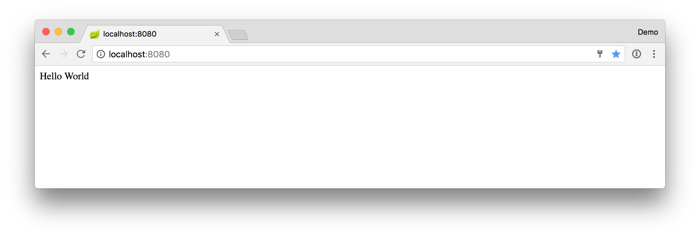

## Create an Authorization Server in Okta

To start authenticating against Okta'a API, you have to first create a developer account on [http://developer.okta.com](http://developer.okta.com). After activating your account, sign in and navigate to **Security > API** and click on the **Add Authorization Server** button.

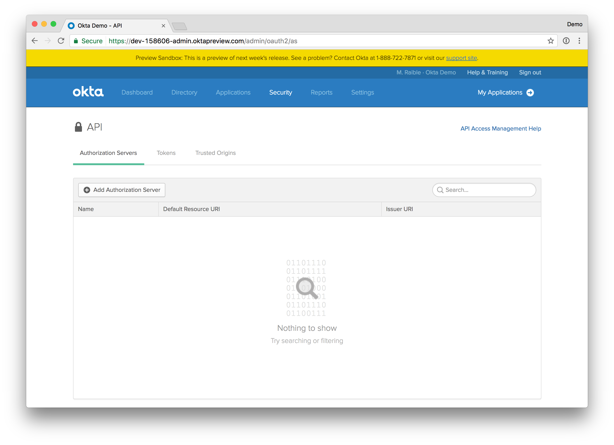

Enter the name and Resource URI of your choosing. The names aren't important at this time. I used the following values:

* **Name:** Oktamus Prime
* **Resource URI:** http://authenticat.is.easy/withokta

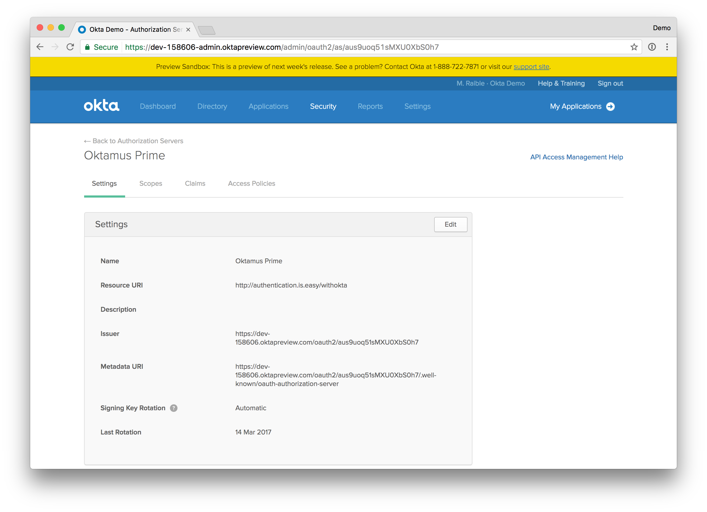

The Metadata URI you see in this screenshot will come in handy later when you need to specify `accessTokenUri` and `userAuthorizationUri` values.

## Create an OpenID Connect App in Okta

To get a client id and secret, you need to create a new OpenID Connect (OIDC) app. Navigate to **Applications > Add Application** and click on the **Create New App** button. The application name isn't important, you can use whatever you like. 

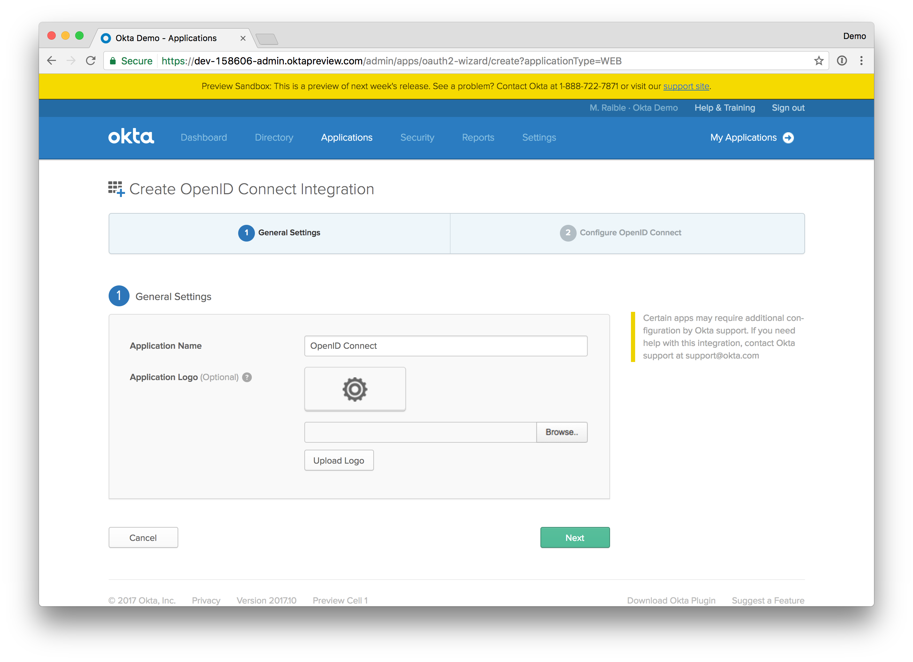

Click **Next** to configure OIDC. Add `http://localhost:8080` as a Redirect URI and click **Finish**.

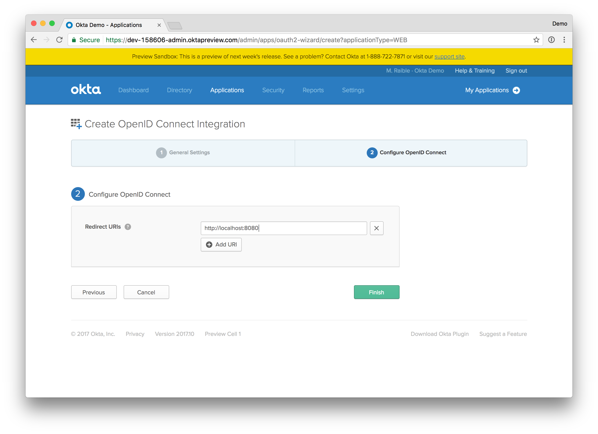

The next screen should look similar to the following screenshot.

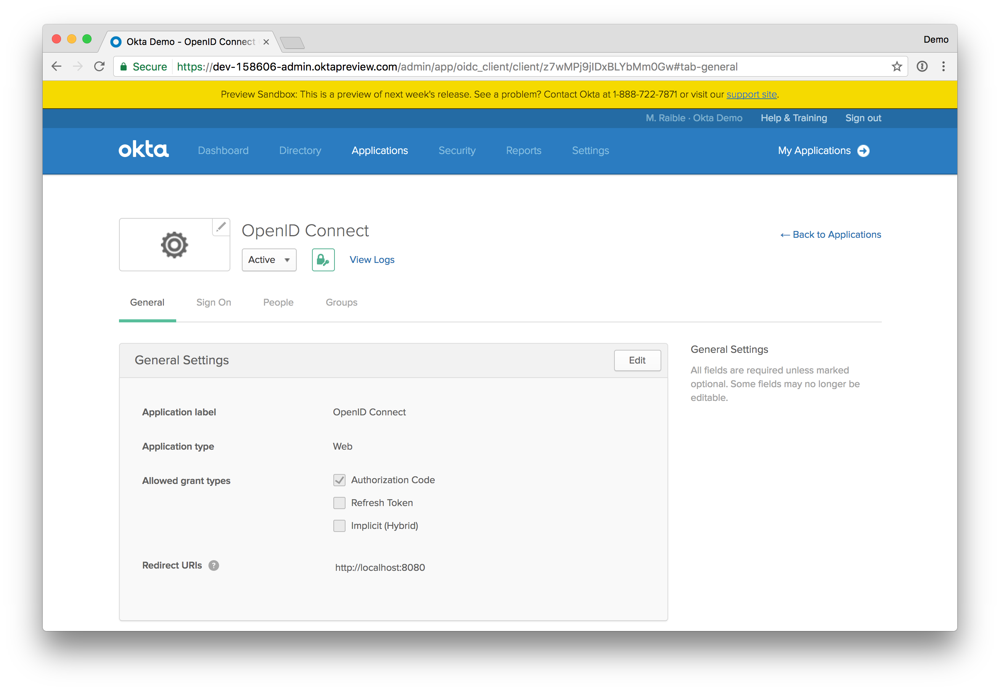

Your `clientId` and `clientSecret` values for this app will be just below the fold. 

## Create a Spring Boot OAuth Client

Create a `helloOAuth.groovy` file that uses Spring Security and its [OAuth2 support](https://spring.io/guides/tutorials/spring-boot-oauth2/). 

```groovy
@Grab('spring-boot-starter-security')
@RestController
@EnableOAuth2Sso
class Application {

  @GetMapping('/')
  String home() {
    'Hello World'
  }
}
```

Adding the `@EnableOAuth2Sso` annotation causes Spring Security to look for a number of properties. Create `application.yml` in the same directory and specify the following key/value pairs.

```yaml
security:
  oauth2:
    client:
      # From OIDC app
      clientId: # clientId
      clientSecret: # clientSecret
      # From Authorization Server's metadata
      accessTokenUri: # token_endpoint
      userAuthorizationUri: # authorization_endpoint 
      clientAuthenticationScheme: form
    resource:
      # from your Auth Server's metadata, check .well-known/openid-configuration if not in .well-known/oauth-authorization-server
      userInfoUri: # userinfo_endpoint
      preferTokenInfo: false
```

Start your app with `spring run helloOAuth.groovy` and navigate to [http://localhost:8080](http://localhost:8080). You'll be redirected to Okta, but likely see the following error.

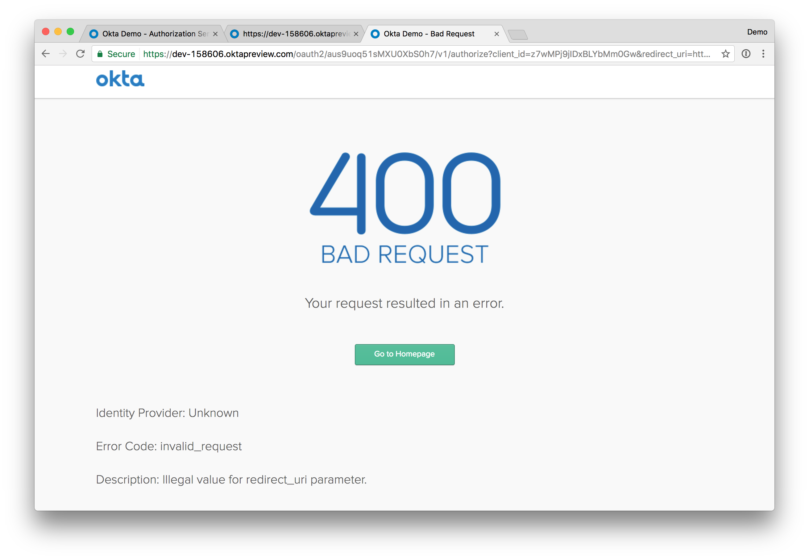

This happens because Spring Security sends a `redirect_uri` value of `http://localhost:8080/login`. Navigate to your Okta developer instance and change your OIDC app to have this as a Redirect URI.

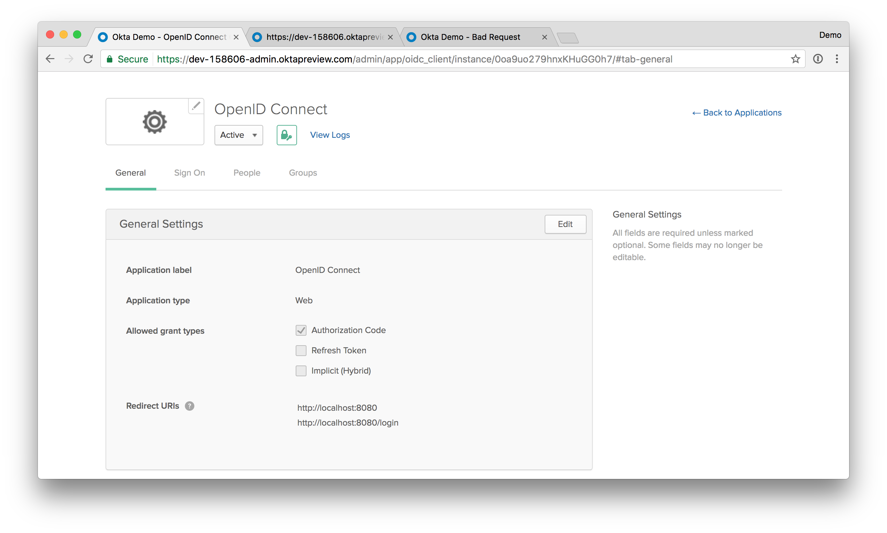

If you hit [http://localhost:8080](http://localhost:8080) again, this time you'll get an error that doesn't explain as much.

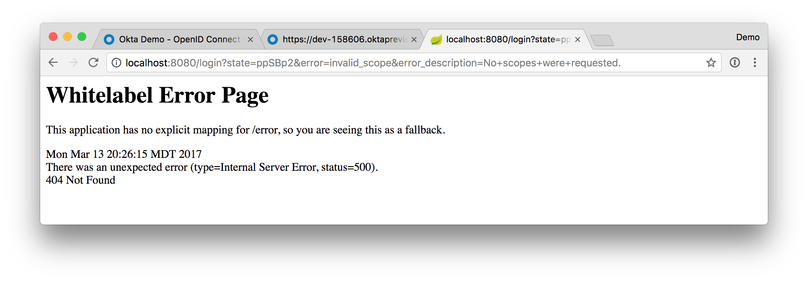

The whitelabel error page doesn't tell you anything, but your browser's address window does: _no scopes were requested_. Modify `application.yml` to have a `scope` property at the same level as `clientAuthenticationScheme`. These are some standard OIDC scopes. 

```yaml
      clientAuthenticationScheme: form
      scope: openid profile email
```

Try [http://localhost:8080](http://localhost:8080) again and you'll get an error that _User is not assigned to the client app_. Again, you'll have to look in the address bar to see it.

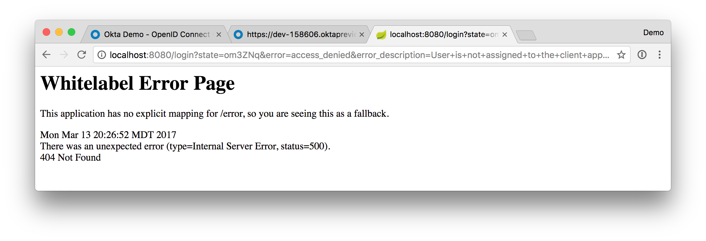

Open your OIDC app in Okta and **Assign People** to it. Adding your own account is the easiest way to do this.

The next error you'll see when trying to authenticate is _Policy evaluation failed_. 

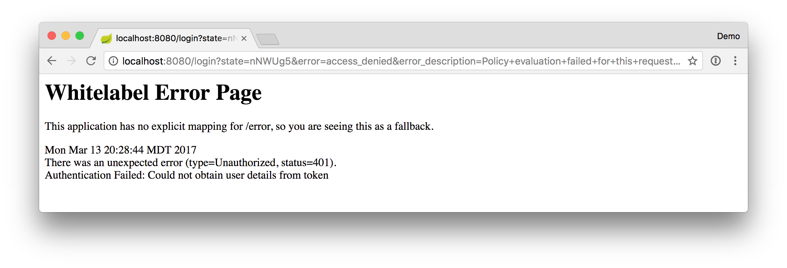

In Okta's UI, navigate to **Security > API** and click on your Authorization Server's name and **Access Policies**. Click **Add Policy** to continue.

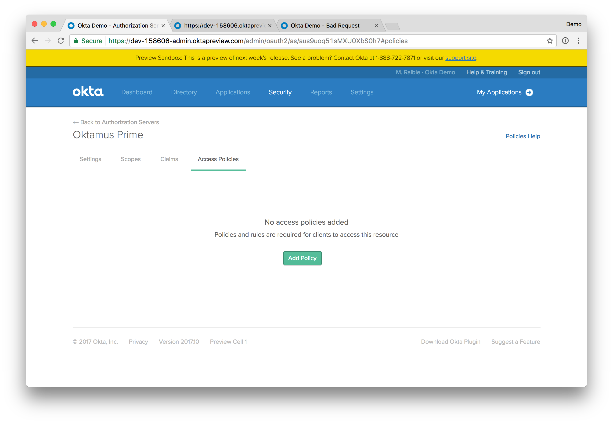

Enter a name and description and set it to apply to all clients.

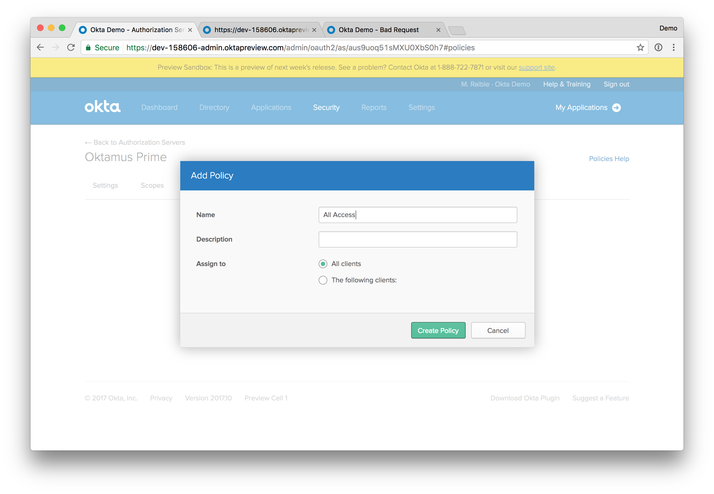

Click **Create Policy** to continue. Once that completes, click the **Add Rule** button.

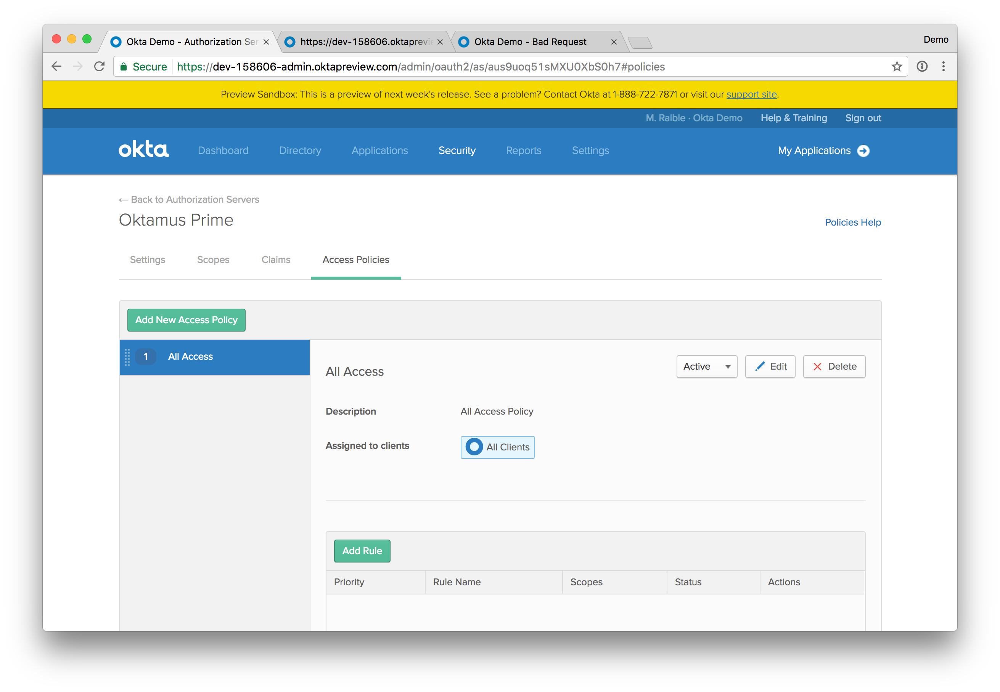

Give the rule a name, accept the default values, and click the **Create Rule** button.

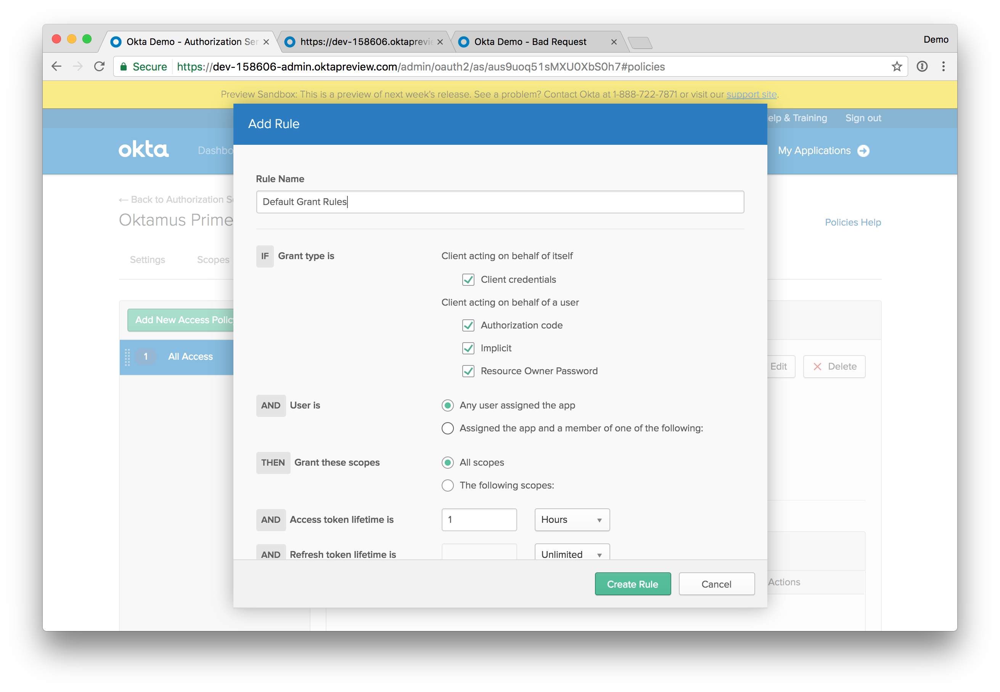

Try [http://localhost:8080](http://localhost:8080) again and this time it should work. If it does - congrats!

You can make one additional change to the `helloOAuth.groovy` file to prove it's really working: change the `home()` method to return `Hello $name` where `$name` is from `javax.security.Principal`.

```groovy
@GetMapping('/')
String home(java.security.Principal user) {
  'Hello ' + user.name
}
```

This should result in your app showing a result like the following.

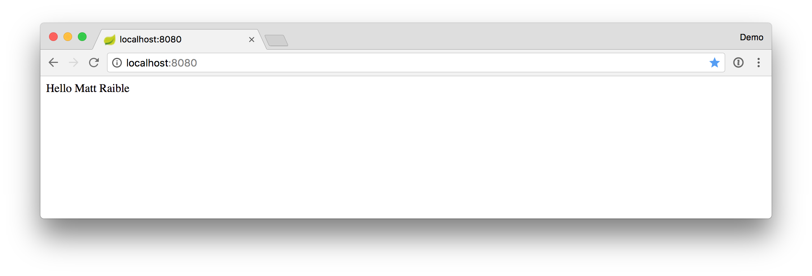

## Get the Source Code

The source code for this tutorial and the examples in it are available [on GitHub](https://github.com/mraible/spring-boot-oauth-example).

## Summary

This tutorial showed you how to use Spring CLI, Groovy, Spring Boot, Spring Security, and Okta to quickly prototype an OAuth client. This information is useful for those that are developing a Spring MVC application with traditional server-rendered pages. However, these days, lots of devs are using JavaScript frameworks and mobile applications to build their UIs. 

In a future tutorial, I'll show you how to develop one of these fancy UIs in Angular and use the access token retrieved to talk to a Spring Boot API that's secured by Spring Security and does JWT validation.
